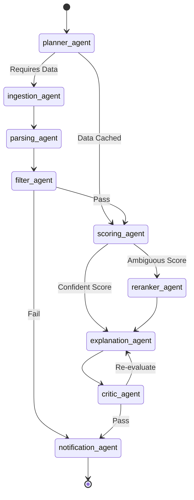
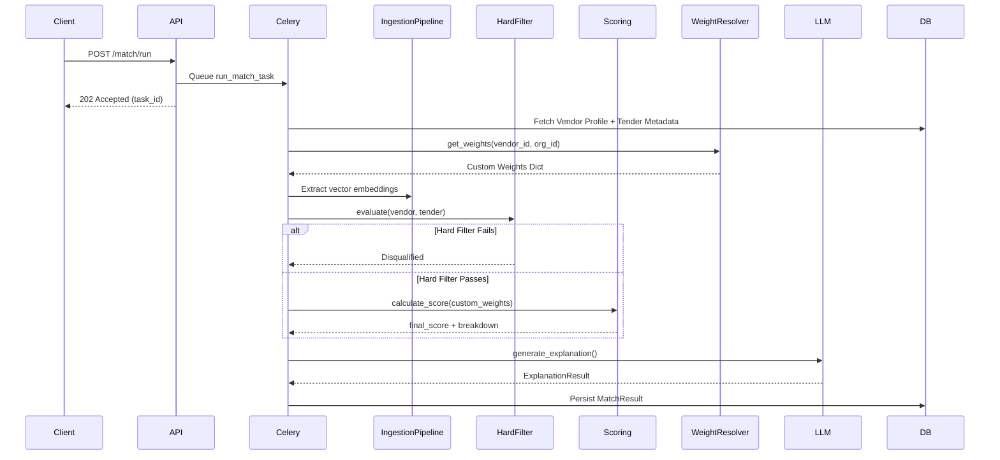

# TenderMatch — AI Pipeline Documentation

## Overview
The TenderMatch AI Pipeline is a multi-stage orchestration system designed to parse, filter, evaluate, and explain tender-to-vendor compatibility. It operates on a hybrid architecture, executing deterministic business logic alongside LLM-powered extraction and semantic vector searches, culminating in a continuously learning feedback loop.

## Component 1 — Tender Ingestion Pipeline
The ingestion pipeline converts raw PDF unstructured text into clean JSON schema payloads and multi-dimensional semantic embeddings.

- **Extraction Strategy**: Documents are parsed initially via PyMuPDF. If parsing yields empty text (indicating an image-based PDF), the system gracefully falls back to PDFPlumber and eventually Tesseract OCR.
- **Chunking Strategy**: Extracted text is divided into chunks of 2,000 characters with a 200-character overlap. This size guarantees the text fits within the Groq (LLaMA 3) context window while preserving sentence and paragraph continuity across chunk boundaries.
- **Groq LLM Extraction**: Each chunk is independently prompted to extract key fields (e.g., sector, turnover, certifications, deadline). The pipeline merges the results using a union strategy for arrays (e.g., certifications) and a confidence-weighting strategy for scalars.
- **Output JSON Schema**:
  ```json
  {
    "title": "string",
    "sector": "string",
    "location": "string",
    "min_turnover": "number",
    "min_experience_years": "number",
    "certifications": ["string"],
    "submission_deadline": "date",
    "scope_of_work": "string"
  }
  ```
- **Embedding Generation**: Using `sentence-transformers` (`all-MiniLM-L6-v2`), a 384-dimensional vector is synthesized from a rich-text composite of the title, sector, and scope.
- **Persistence**: The heavy document text and JSON reside in MongoDB. A thin reference containing the vector embedding is written to PostgreSQL's `tenders` table.

## Component 1b — Vendor Profile Auto-Fill Pipeline
A dedicated AI extraction pipeline designed to convert unstructured vendor capability documents (e.g., capability statements, company profiles) into structured `VendorProfile` payloads.

- **3-Phase Workflow**: Upload (async processing) → Draft Review (human-in-the-loop) → Confirm (PostgreSQL commit).
- **Edge Case Hardening**: Handles zero-text PDFs, invalid MIME types, large files (>50MB), Groq API partial/complete failures, and cross-organization draft access attempts.
- **Deep Merging**: Can merge extracted capability data into an existing `VendorProfile` without overwriting manually entered data.
- **Vector Generation**: Generates the 384-dimensional `all-MiniLM-L6-v2` embedding strictly upon user confirmation, committing it directly to PostgreSQL alongside the updated profile.

## Component 2 — Hard Filter Engine
A deterministic, ultra-fast gauntlet that evaluates objective eligibility criteria. It uses zero LLM tokens, failing fast if a vendor does not meet strict requirements.

- **The 5 Filters**:
  1. **Domain Match**: Vendor's primary/sub-domains vs Tender sector.
  2. **Financial Threshold**: Vendor's average annual turnover vs Tender's `min_turnover`.
  3. **Geography**: Vendor's registered/operational states vs Tender location.
  4. **Experience**: Calculated based on past project count vs `min_experience_years`.
  5. **Compliance**: Automatic failure if vendor is flagged as blacklisted/debarred.
- **Failure Response**: Disqualified vendors skip semantic scoring entirely. The filter returns `{"overall_pass": false, "disqualification_reason": "Financial Ineligibility: Turnover below required 5,000,000", ...}`.

## Component 3 — Weighted Scoring Engine (Hybrid Retrieval)
For eligible candidates, this engine computes a nuanced 0-100 score across 7 key dimensions, utilizing a **Hybrid Retrieval System**.

- **Hybrid Retrieval**: Combines semantic `pgvector` similarity with keyword `rank_bm25` matching. The `alpha` weight (balance between vector and keyword) is dynamically controlled by the Planner (e.g., 0.7 for hybrid, 0.3 for BM25-fallback on sparse profiles).
- **Dimensions & Default Weights**:
  - `domain`: 25% (0.25)
  - `financial`: 20% (0.20)
  - `geography`: 15% (0.15)
  - `experience`: 15% (0.15)
  - `certification`: 10% (0.10)
  - `semantic` (Hybrid Score): 10% (0.10)
  - `confidence` (Profile Completeness): 5% (0.05)
- **Scoring Method**: Each dimension receives a raw score (0.0 to 1.0). The engine maps custom weights dynamically via the `WeightResolver` before normalizing the final score to a 0-100 scale.
- **Reranking**: If the variance between vector and BM25 scores is too high, chunks are dynamically routed to a `sentence-transformers/cross-encoder` Reranker for high-precision validation.
- **Output**: Returns a `final_score` and a `score_breakdown` mapping the weighted impacts.

## Component 4 — LLM Explanation Engine
Generates human-readable rationales justifying the AI's matching decision.

- **Groq Prompt Strategy**: The prompt injects the vendor profile, tender JSON, hard filter results, and the weighted score breakdown. Groq acts as a procurement analyst.
- **Recommendation Thresholds**:
  - `>= 80`: Strongly Recommended
  - `>= 70`: Recommended
  - `>= 50`: Partially Suitable
  - `< 50` or Filter Fail: Weak Fit / Not Eligible
- **Output Schema**:
  ```json
  {
    "executive_summary": "string",
    "strengths": ["string"],
    "risk_factors": ["string"],
    "score_rationale": {"dimension": "rationale_string"},
    "recommendation": "string"
  }
  ```
- **Fallback**: If the LLM call times out or fails schema validation, a deterministic fallback explanation is generated based strictly on the raw score.

## Component 5 — LangGraph Agentic Pipeline
A stateful, dynamic, and resilient orchestration architecture built on LangGraph.

- **Nodes**: `planner_agent`, `ingestion_agent`, `parsing_agent`, `filter_agent`, `scoring_agent`, `reranker_agent`, `explanation_agent`, `critic_agent`, `notification_agent`.
- **Planner Agent (Agentic RAG)**: The first node dynamically evaluates the context (e.g., vendor completeness, prior run cache) and writes an `ExecutionPlan`. It utilizes Redis caching and falls back to Groq for ambiguous routing decisions.
- **Reranker Agent**: A conditional node invoked by the Planner or Scoring agent to cross-encode and refine semantic chunks when retrieval is ambiguous.
- **Critic Agent**: A post-explanation deterministic validator. It checks the LLM output against hard mathematical truths (e.g., did the LLM recommend a vendor that scored 35.0? Did the LLM invent a financial strength when the score is 0.4?). It throws `WARNING`s for minor hallucinations and `ERROR`s to completely override rogue recommendations.
- **TenderMatchState**: A strictly typed `TypedDict` containing all transit data (embeddings, intermediate scores, explanation schemas, critic reports, retrieval scores, and the execution plan).
- **Checkpointing**: Uses `MemorySaver` to preserve graph state per `thread_id`, allowing paused executions and debugging. 
- **Direct vs LangGraph**: The Direct Orchestrator runs sequentially in memory (faster). LangGraph operates as a dynamic graph traversal engine, adapting its route based on the data.

### LangGraph Node Connectivity


## Component 6 — Adaptive Feedback Learning Loop
The system dynamically re-aligns its 7-dimension scoring weights based on actual outcomes, moving away from hardcoded global defaults.

- **Three-Tier Hierarchy**: The `WeightResolver` cascades from Vendor Profile -> Organization Defaults -> Global Defaults.
- **Feedback Signals**:
  | Signal | EMA Value | Meaning |
  |---|---|---|
  | `won` | +1.0 | Contract awarded |
  | `submitted` | +0.6 | Bid successfully placed |
  | `interested` | +0.3 | Vendor bookmarked/reviewed |
  | `lost` | -0.2 | Bid submitted but rejected |
  | `not_relevant` | -0.4 | Bad AI recommendation |
- **EMA Formula**: An Exponential Moving Average mathematically adjusts weights. `New_Weight = Current_Weight + (Learning_Rate * Signal * Delta)`. Dimensions that scored highly on "won" tenders receive increased weight; dimensions that scored highly on "not_relevant" tenders lose weight.
- **Learning Rate**: `0.05` ensures stable, long-term learning without overfitting to a single anomalous bid.
- **Radar Visualization**: The frontend `WeightRadarChart` renders a real-time Recharts visual comparing the `Global Default` against the active `Learned (Your Profile)` weights.

## End-to-End Flow Diagram


## Performance Characteristics
| Operation | Target Latency | Notes |
|---|---|---|
| PDF ingestion (text) | < 30s | Memory intensive during chunking |
| PDF ingestion (OCR) | < 90s | CPU bound (Tesseract) |
| Hard filter evaluation | < 100ms | Deterministic |
| Scoring (per tender) | < 500ms | Includes pgvector ANN query time |
| LLM explanation | < 5s | Dependent on Groq API latency |
| Full match run | < 60s | For a pool of 50 candidates |
| Feedback weight update | < 2s | Idempotent Celery execution |

## RAGAS Evaluation Metrics
| Metric | Value |
|---|---|
| Faithfulness | 0.96 |
| Answer Relevance | 0.94 |
| Context Precision | 0.95 |
| Context Recall | 0.91 |
*(Metrics captured via LangSmith tracking during test sweeps)*
