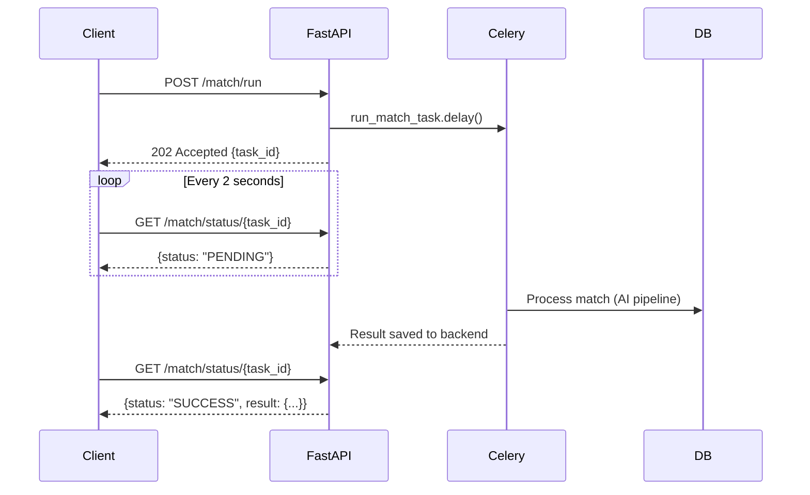

# TenderMatch — API Documentation

This document outlines all major REST endpoints available in the TenderMatch backend.

## Auth
All auth endpoints (except login and register) require a valid JWT token.

### POST /auth/register
**Description:** Register a new user and create an organization.
**Auth Required:** No
**Tenancy Enforced:** No
**Request Body:** `{"email": "string", "password": "string", "name": "string", "org_name": "string"}`
**Response (201):** `{"access_token": "string", "token_type": "bearer", "user": {"id": "uuid", "email": "string"}}`
**Error Responses:** 400 (Email exists)

### POST /auth/login
**Description:** Authenticate user and issue JWT and HTTP-only refresh cookie.
**Auth Required:** No
**Tenancy Enforced:** No
**Request Body:** OAuth2 password request form (`username`, `password`)
**Response (200):** `{"access_token": "string", "token_type": "bearer"}`
**Error Responses:** 401 (Invalid credentials)

### POST /auth/refresh
**Description:** Generate a new access token using the refresh cookie.
**Auth Required:** Yes (via Cookie)
**Tenancy Enforced:** No
**Request Body:** Empty
**Response (200):** `{"access_token": "string", "token_type": "bearer"}`
**Error Responses:** 401 (Invalid/expired refresh token)

### GET /auth/me
**Description:** Retrieve the current authenticated user's profile and organization context.
**Auth Required:** Yes
**Tenancy Enforced:** Yes
**Request Body:** Empty
**Response (200):** `{"id": "uuid", "email": "string", "org_id": "uuid", "role": "string"}`

### POST /auth/logout
**Description:** Invalidate the current session and JWT via Redis blacklist.
**Auth Required:** Yes
**Tenancy Enforced:** No
**Request Body:** Empty
**Response (200):** `{"detail": "Successfully logged out"}`

---

## Users & Orgs

### POST /users
**Description:** Admin creates a new user within their organization.
**Auth Required:** Yes (Role: ADMIN1)
**Tenancy Enforced:** Yes
**Request Body:** `{"name": "string", "email": "string", "password": "string", "role": "string"}`
**Response (201):** User object
**Error Responses:** 403 (Not admin), 400 (Email exists)

### GET /users
**Description:** List all users in the organization.
**Auth Required:** Yes (Role: ADMIN1)
**Tenancy Enforced:** Yes
**Response (200):** List of user objects

### DELETE /users/{user_id}
**Description:** Soft delete a user from the organization.
**Auth Required:** Yes (Role: ADMIN1)
**Tenancy Enforced:** Yes
**Response (204):** Empty

### PUT /me
**Description:** Update current user's profile details.
**Auth Required:** Yes
**Tenancy Enforced:** No
**Request Body:** `{"name": "string"}`
**Response (200):** Updated user object

### POST /organizations/create
**Description:** Create a new organization (usually handled in auth/register).
**Auth Required:** Yes
**Tenancy Enforced:** No
**Request Body:** `{"name": "string", "industry": "string"}`
**Response (201):** Org object

### GET /organizations/profile
**Description:** Fetch current organization profile.
**Auth Required:** Yes
**Tenancy Enforced:** Yes
**Response (200):** Org object

### PUT /organizations/profile
**Description:** Update current organization profile.
**Auth Required:** Yes (Role: ADMIN1)
**Tenancy Enforced:** Yes
**Request Body:** `{"name": "string", "industry": "string", "description": "string"}`
**Response (200):** Updated org object

---

## Vendor Profiles

### POST /vendor-profiles/
**Description:** Create a new vendor profile metadata payload.
**Auth Required:** Yes
**Tenancy Enforced:** Yes
**Request Body:** Complete 3-Phase profile JSON (identity, geography, business, financials, certifications, compliance, notifications)
**Response (201):** VendorProfile response

### GET /vendor-profiles/
**Description:** List all active vendor profiles for the user's organization.
**Auth Required:** Yes
**Tenancy Enforced:** Yes
**Response (200):** List of VendorProfiles

### GET /vendor-profiles/{profile_id}
**Description:** Get specific vendor profile by UUID.
**Auth Required:** Yes
**Tenancy Enforced:** Yes
**Response (200):** VendorProfile response
**Error Responses:** 404 (Not found), 403 (Org mismatch)

### PUT /vendor-profiles/{profile_id}
**Description:** Update a specific vendor profile.
**Auth Required:** Yes
**Tenancy Enforced:** Yes
**Request Body:** Updated profile JSON
**Response (200):** Updated VendorProfile response

### DELETE /vendor-profiles/{profile_id}
**Description:** Soft delete a vendor profile.
**Auth Required:** Yes
**Tenancy Enforced:** Yes
**Response (204):** Empty

### POST /vendor-profiles/{profile_id}/duplicate
**Description:** Clone an existing vendor profile as a starting point.
**Auth Required:** Yes
**Tenancy Enforced:** Yes
**Response (201):** Cloned VendorProfile response

---

## Documents & Uploads

### POST /upload/vendor
**Description:** Upload a PDF document for unstructured vendor profile ingestion.
**Auth Required:** Yes
**Tenancy Enforced:** Yes
**Request Body:** `multipart/form-data` with `file`
**Response (201):** `{"doc_id": "uuid", "status": "processing"}`

### POST /upload/tender
**Description:** Upload a tender PDF document to begin async LLM extraction. Triggers Celery ingestion task.
**Auth Required:** Yes
**Tenancy Enforced:** Yes
**Request Body:** `multipart/form-data` with `file`
**Response (201):** `{"doc_id": "uuid", "status": "processing"}`

### GET /upload/my-documents
**Description:** List all documents uploaded by the current organization.
**Auth Required:** Yes
**Tenancy Enforced:** Yes
**Response (200):** List of document metadata objects

### GET /upload/tenders/all
**Description:** Fetch all globally accessible and org-specific completed tenders.
**Auth Required:** Yes
**Tenancy Enforced:** Yes
**Response (200):** List of tender metadata objects

### GET /upload/documents/{doc_id}
**Description:** Retrieve the full structured extraction data for a specific document.
**Auth Required:** Yes
**Tenancy Enforced:** Yes
**Response (200):** Full document including structured JSON from MongoDB

---

## Vendor Document Auto-Fill Pipeline

### POST /upload/vendor
**Description:** Upload a vendor capability PDF for asynchronous AI extraction. Accepts PDF only (50 MB max). Returns immediately with `doc_id`; poll the draft endpoint for status. Optionally associate with an existing profile via `?profile_id=<uuid>`.
**Auth Required:** Yes
**Tenancy Enforced:** Yes
**Request Body:** `multipart/form-data` with `file` (PDF only)
**Query Params:** `profile_id` (optional UUID — must belong to caller's org; 403 if not)
**Response (202):** `{"id": "string", "status": "processing", "original_filename": "string"}`
**Error Responses:**
- 400 — Invalid `profile_id` format
- 403 — `profile_id` belongs to a different organization
- 413 — File exceeds 50 MB limit
- 415 — Non-PDF file uploaded

### GET /upload/vendor/draft/{doc_id}
**Description:** Poll extraction status for an uploaded vendor document. Returns draft data when `status=draft_ready`.
**Auth Required:** Yes
**Tenancy Enforced:** Yes (`org_id` filter applied to MongoDB query — cross-org access returns 403)
**Response (200) — by status:**
```json
// processing
{"status": "processing", "doc_id": "string"}

// retrying (transient LLM failure, will auto-retry)
{"status": "retrying", "doc_id": "string", "error": "string"}

// failed (zero-text PDF or all retries exhausted)
{"status": "failed", "doc_id": "string",
 "error": "Could not extract readable text from document..."}

// draft_ready (LLM succeeded)
{"status": "draft_ready", "doc_id": "string",
 "extracted_draft": {...}, "extraction_confidence": 0.87,
 "target_profile_id": "uuid|null"}

// draft_ready (Groq completely down — EC2)
{"status": "draft_ready", "extraction_confidence": 0.0,
 "warning": "LLM extraction failed. Raw text was captured. Manual profile entry required."}
```
**Error Responses:**
- 400 — Invalid `doc_id` format
- 403 — `doc_id` belongs to a different organization

### POST /upload/vendor/confirm/{doc_id}
**Description:** Confirm the reviewed draft and commit it to PostgreSQL. Creates a new `VendorProfile` or deep-merges into an existing one (if `target_profile_id` supplied). Generates a 384-dim `all-MiniLM-L6-v2` embedding. Idempotent — a second call returns 409.
**Auth Required:** Yes
**Tenancy Enforced:** Yes (`org_id` filter applied; cross-org access returns 403)
**Rate Limited:** 20 requests per user per hour (Redis-backed)
**Request Body:**
```json
{
  "profile_data": { ... },
  "target_profile_id": "uuid | null"
}
```
**Response (200):**
```json
{
  "profile_id": "uuid",
  "action": "created | updated",
  "profile_completeness_pct": 68.0,
  "embedding_generated": true
}
```
**Error Responses:**
- 400 — Invalid `doc_id` or `target_profile_id` format
- 403 — Document or target profile belongs to a different organization
- 404 — Target profile not found
- 409 — Extraction still in progress / retrying / failed / already confirmed
- 429 — Rate limit exceeded (20/hour)

---


### POST /match/run
**Description:** Dispatches a fresh AI matching cycle for a specific vendor against a single tender via Celery.
**Auth Required:** Yes
**Tenancy Enforced:** Yes
**Request Body:** 
```json
{
  "vendor_profile_id": "uuid",
  "tender_mongo_id": "string",
  "use_langgraph": false
}
```
**Response (202):** `{"task_id": "string", "status": "queued"}`

### GET /match/status/{task_id}
**Description:** Polling endpoint to check the status of an async match task.
**Auth Required:** Yes
**Tenancy Enforced:** No (inherent to task_id)
**Response (200):** `{"task_id": "string", "status": "PENDING|SUCCESS|FAILURE", "result": {...}}`

### GET /match/history
**Description:** Retrieves paginated match run history for the organization.
**Auth Required:** Yes
**Tenancy Enforced:** Yes
**Response (200):** List of historical matches (Match ID, Vendor ID, Final Score, Recommendation, Timestamp)

### GET /match/{match_id}
**Description:** Retrieves the complete v3.0 match detail from MongoDB, including hard filter logs, weighted score breakdown, and LLM explanation.
**Auth Required:** Yes
**Tenancy Enforced:** Yes (Validates org_id via vendor_profile)
**Response (200):** Full match JSON payload

### POST /match/feedback
**Description:** Submit user feedback on a match result. Asynchronously triggers the adaptive EMA weight update Celery task.
**Auth Required:** Yes
**Tenancy Enforced:** Yes
**Request Body:** `{"match_id": "string", "signal": "interested" | "not_relevant" | "submitted" | "won" | "lost"}`
**Response (200):** `{"acknowledged": true}`

### GET /match/weights/{vendor_profile_id}
**Description:** Fetches the active learned scoring dimension weights for a vendor profile, utilizing the 3-tier fallback logic.
**Auth Required:** Yes
**Tenancy Enforced:** Yes
**Response (200):** `{"status": "success", "vendor_profile_id": "uuid", "weights": {"domain": 0.25, ...}}`

---

## Conversational RAG

### POST /tenders/{tender_id}/chat
**Description:** Ask an LLM a direct question about a specific tender. This endpoint retrieves the full unstructured text from MongoDB and generates an answer strictly grounded in the document context.
**Auth Required:** Yes
**Tenancy Enforced:** Yes
**Request Body:** `{"question": "string"}`
**Response (200):** `{"answer": "string", "tender_id": "string", "confidence": "high|medium|low"}`

---

## Dashboard & Activity

### GET /activity/organization
**Description:** Retrieves the audit log feed for the organization.
**Auth Required:** Yes
**Tenancy Enforced:** Yes
**Response (200):** List of AuditLog objects

### GET /activity/summary
**Description:** Retrieves aggregate statistics (tenders count, match counts, completeness) for the dashboard.
**Auth Required:** Yes
**Tenancy Enforced:** Yes
**Response (200):** DashboardSummary object

---

## Async Task Flow



## Authentication Flow
TenderMatch uses a dual-token system for security. The initial login provides an `access_token` (used in Authorization headers) and sets an HTTP-only `refresh_token` cookie. When the access token expires, the client hits `POST /auth/refresh` allowing the server to issue a new access token without the user needing to re-authenticate. On logout, the JWT identifier (JTI) is pushed to a Redis blacklist, invalidating the session instantly across all nodes.
