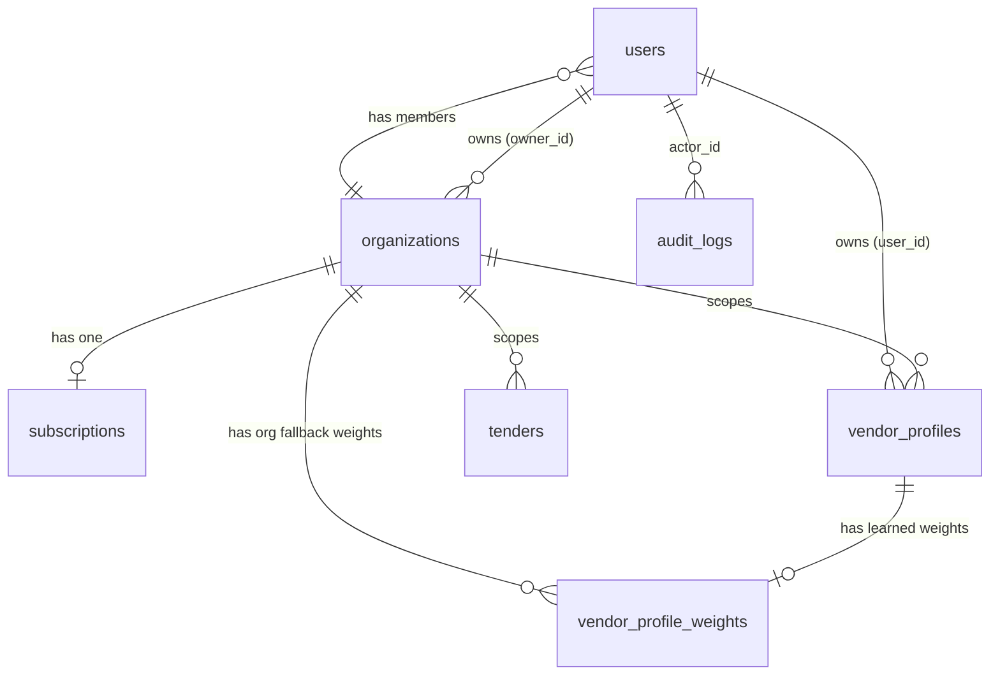

# TenderMatch — Database Architecture

## Strategy: Polyglot Persistence
TenderMatch employs a polyglot persistence strategy to leverage the strengths of different database paradigms, ensuring both transactional integrity and flexible document storage.
- **PostgreSQL** is the authoritative source for relational data (users, organizations, subscriptions, audit logs), rigid structures like Vendor Profiles, and the pgvector extension for high-performance semantic search (HNSW index).
- **MongoDB** is used as a document store to handle highly variable, unstructured, or deeply nested JSON payloads like raw tender text, LLM extractions, and complex match result explanations.
- **Redis** operates as the fast, ephemeral data store for Celery task queuing, JWT blacklisting, and rate limiting.

## PostgreSQL — Schema Reference

### `users`
Purpose: Relational user record storing identity, credentials, and organizational membership.
- **id**: UUID (PK)
- **mongo_id**: String(24) (Unique, Index) | Cross-reference to legacy MongoDB users
- **name**: String(255)
- **email**: String(255) (Unique, Index)
- **password_hash**: String(255)
- **role**: String(20) | e.g. ADMIN1, USER, SUPER
- **org_id**: UUID (FK -> organizations.id, Index)
- **is_active**: Boolean (Default: true)
- **created_at**: DateTime
- **updated_at**: DateTime
- **last_login_at**: DateTime (Nullable)

### `organizations`
Purpose: The root of the tenant isolation tree, scoping all vendor profiles, tenders, and matches to a specific tenant.
- **id**: UUID (PK)
- **mongo_id**: String(24) (Unique, Index)
- **name**: String(255) (Index)
- **industry**: String(100) (Nullable)
- **description**: Text (Nullable)
- **website**: String(255) (Nullable)
- **location**: String(255) (Nullable)
- **owner_id**: UUID (FK -> users.id)
- **is_active**: Boolean (Default: true)
- **created_at**: DateTime
- **updated_at**: DateTime

### `subscriptions`
Purpose: Tracks the billing plan, feature limits, and active status for an organization (SaaS enablement).
- **id**: UUID (PK)
- **org_id**: UUID (FK -> organizations.id, Unique, Index)
- **plan**: String(50) | e.g., free, pro, enterprise
- **status**: String(50) | e.g., trialing, active, past_due
- **max_vendor_profiles**: Integer (Default: 3)
- **max_tenders_per_month**: Integer (Default: 50)
- **max_match_runs_per_day**: Integer (Default: 10)
- **email_notifications_enabled**: Boolean (Default: true)
- **ai_explanation_enabled**: Boolean (Default: false)
- **external_subscription_id**: String(255) (Index)
- **external_customer_id**: String(255)
- **trial_ends_at**, **current_period_start**, **current_period_end**, **cancelled_at**: DateTime
- **metadata_json**: JSON
- **created_at**, **updated_at**: DateTime

### `vendor_profiles`
Purpose: Authoritative source of truth for vendor data, stored completely in PostgreSQL using JSONB.
- **id**: UUID (PK)
- **org_id**: UUID (FK -> organizations.id, Index)
- **user_id**: UUID (FK -> users.id, Index)
- **vendor_id**: String(20) (Unique, Index)
- **business_name**: String(255) (Index)
- **profile_data**: JSONB | The complete structured 3-phase vendor profile
- **profile_version**: Integer
- **profile_completeness_pct**: Float
- **completeness_details**: JSONB
- **is_active**: Boolean
- **embedding**: Vector(384) | Semantic vector representing vendor capabilities
- **created_at**, **updated_at**: DateTime

### `tenders`
Purpose: A thin pointer bridging PostgreSQL vectors to rich MongoDB documents for rapid similarity search.
- **id**: UUID (PK)
- **mongo_id**: String(24) (Unique, Index) | Pointer to the document in Mongo
- **org_id**: UUID (FK -> organizations.id, Index)
- **filename**: String(255)
- **scope**: Text
- **location**: String(255)
- **embedding**: Vector(384) | Used for pgvector semantic similarity search
- **summary**: JSONB
- **created_at**: DateTime

### `vendor_profile_weights`
Purpose: Stores the dynamically learned 7-dimension AI weights, adapting to user feedback.
- **id**: UUID (PK)
- **vendor_profile_id**: UUID (FK -> vendor_profiles.id, Unique, Index)
- **org_id**: UUID (FK -> organizations.id, Index)
- **weight_domain**: Float (Default: 0.25)
- **weight_geography**: Float (Default: 0.15)
- **weight_financial**: Float (Default: 0.20)
- **weight_experience**: Float (Default: 0.15)
- **weight_certification**: Float (Default: 0.10)
- **weight_semantic**: Float (Default: 0.10)
- **weight_confidence**: Float (Default: 0.05)
- **total_feedback_count**: Integer (Default: 0)
- **created_at**, **updated_at**: DateTime

### `audit_logs`
Purpose: Records every significant state-changing action in the system for security and compliance.
- **id**: UUID (PK)
- **actor_id**: UUID (FK -> users.id, Index, Nullable)
- **org_id**: UUID (Index, Nullable)
- **action**: String(100) (Index)
- **resource_type**: String(50) (Index)
- **resource_id**: String(100)
- **metadata_json**: JSON
- **description**: Text
- **ip_address**, **user_agent**: String
- **status**: String(20)
- **created_at**: DateTime (Index)
- **Composite Indexes**: (org_id, created_at), (action, status)

### Entity Relationship Diagram


## MongoDB — Collections Reference

### `documents`
- **Purpose**: Stores the raw uploaded text and the Groq-extracted structured JSON payload for tenders.
- **Schema**:
  - `_id`: ObjectId
  - `original_filename`: String
  - `type`: String ("tender", "vendor_profile_doc")
  - `status`: String ("processing", "completed", "failed")
  - `raw_text`: String (Extracted via PyMuPDF/OCR)
  - `structured_data`: Object (The deep LLM-extracted JSON requirements)
  - `extraction_confidence`: Float
  - `user_id`: String (UUID)
  - `org_id`: String (UUID)
  - `created_at`: Date
- **Indexes**: `{"user_id": 1}`, `{"org_id": 1}`, `{"status": 1}`
- **Approx Size**: ~15-50KB per document depending on PDF length.

### `match_results`
- **Purpose**: A comprehensive snapshot of an AI matching run, freezing the evaluation criteria at that point in time.
- **Schema**:
  - `_id`: ObjectId
  - `match_result`: 
    - `_meta`: match_id, vendor_profile_id, tender_mongo_id, matched_at, pipeline, engine_version
    - `hard_filter_results`: overall_pass, disqualification_reason, check_results
    - `weighted_score`: final_score, breakdown (detailed dimensions)
    - `explanation`: executive_summary, strengths, risk_factors, recommendation
  - `feedback_signal`: String (interested, not_relevant, won, lost)
  - `feedback_updated_at`: Date
- **Indexes**: `{"match_result._meta.match_id": 1}`, `{"match_result._meta.vendor_profile_id": 1}`
- **Approx Size**: ~5-10KB per match.

### `vendor_profiles` (Legacy)
- **Purpose**: Historical MongoDB vendor collections prior to the PostgreSQL migration. Gradually being phased out in favor of the PostgreSQL JSONB `profile_data` column.
- **Indexes**: `{"user_id": 1}`

### `sync_logs`
- **Purpose**: Tracks the execution history, status, and health of scheduled automated scraping and API synchronization tasks (e.g., Bidassist Service, Scraping Service).
- **Schema**:
  - `_id`: ObjectId
  - `task_type`: String ("bidassist_api", "scraper_cppp", etc.)
  - `status`: String ("started", "completed", "failed")
  - `started_at`: Date
  - `completed_at`: Date
  - `records_processed`: Integer
  - `records_added`: Integer
  - `records_updated`: Integer
  - `error_message`: String (Nullable)
- **Indexes**: `{"task_type": 1}`, `{"started_at": -1}`
- **Approx Size**: < 1KB per execution record.

## Redis — Key Reference

| Key Pattern | TTL | Purpose |
|---|---|---|
| `celery-task-meta-*` | 24 hours | Celery task state and result payloads |
| `jwt_blacklist:<jti>` | Token Expiry | Deny-list for immediately revoked or logged-out JWTs |
| `rate_limit:<ip>:<route>` | 60 seconds | Throttling requests to prevent brute force |

## The Polyglot Bridge
TenderMatch bridges the relational guarantees of PostgreSQL with the document flexibility of MongoDB using a dual-write sync architecture. When a tender is processed, its heavy JSON goes to Mongo, and an empty structural pointer (with the `mongo_id`) goes to Postgres holding the `pgvector` embedding.

```mermaid
flowchart LR
    subgraph PostgreSQL
    T[tenders table]
    T_id[id (UUID)]
    T_mongo[mongo_id (String)]
    T_vec[embedding (Vector 384)]
    end
    
    subgraph MongoDB
    D[documents collection]
    D_id[_id (ObjectId)]
    D_json[structured_data (JSON)]
    D_text[raw_text (String)]
    end
    
    T_mongo -->|Points To| D_id
```

## vendor_profile_weights — Deep Dive
The `vendor_profile_weights` table drives the **Adaptive Feedback Learning Loop**.
It contains 7 float columns representing the weight of each evaluation dimension: `weight_domain`, `weight_geography`, `weight_financial`, `weight_experience`, `weight_certification`, `weight_semantic`, and `weight_confidence`.

- **total_feedback_count**: Tracks how many signals have actively shaped these weights.
- **Three-tier fallback logic**: The `WeightResolver` service queries this table looking for the most specific weights first.
  1. **Vendor Profile Level**: Is there a row explicitly mapped to `vendor_profile_id`?
  2. **Org Level**: If not, is there a row mapped to `org_id` where `vendor_profile_id` is null?
  3. **Global Level**: If neither exist, return the hardcoded system defaults.

## Scaling Considerations
- **PostgreSQL**: The `pgvector` embedding column utilizes an HNSW (Hierarchical Navigable Small World) index to achieve extremely fast Approximate Nearest Neighbor (ANN) searches, allowing similarity matches to scale to millions of vectors seamlessly. Read replicas should be considered for read-heavy operations like dashboard analytics.
- **MongoDB**: Designed to be horizontally scaled via sharding if the `documents` collection outgrows single-node limits.
- **Redis**: Should be deployed in a highly available cluster mode, acting as the distributed lock manager, Celery broker, and ephemeral session state manager.
