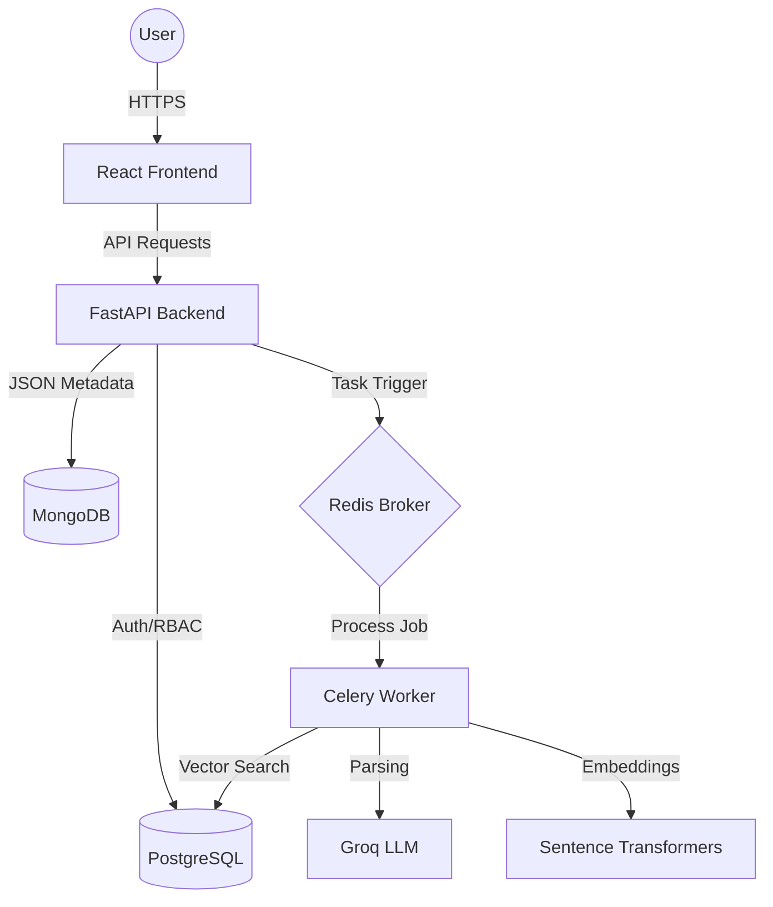

# TenderMatch 🚀 — Enterprise AI Procurement Intelligence

TenderMatch is a high-performance, production-ready semantic matching engine designed for the procurement industry. It automates the extraction, structuring, and matching of complex tender and vendor documents using state-of-the-art Natural Language Processing (NLP) and vector databases.

[](https://fastapi.tiangolo.com/)
[](https://reactjs.org/)
[](https://www.postgresql.org/)
[](https://www.mongodb.com/)
[](https://redis.io/)
[](https://www.docker.com/)

---

## 1. Project Overview

### The Problem
Procurement teams and vendors waste thousands of hours manually reading 50+ page tender PDFs to determine eligibility. Traditional keyword-based search fails to capture nuances in scope, technical requirements, and financial eligibility, leading to missed opportunities and wasted bids.

### The Solution
TenderMatch solves this by transforming unstructured procurement data into actionable intelligence. By combining **LLM-driven document parsing** with **High-Dimensional Vector Matching**, it provides instant, semantic alignment between vendor capabilities and tender requirements.

### Core Users
- **Vendors**: Manage multiple business profiles and get instant "Go/No-Go" recommendations for live tenders.
- **Organization Admins**: Oversee team activity, manage sub-users, and track procurement performance.
- **Tender Analysts**: Upload and vectorize complex tender requirements for automated matching.

---

## 2. Features Implemented So Far

### 🔐 Authentication & Security
- **Dual-Token Strategy**: Short-lived JWT access tokens + HTTPOnly Refresh Cookies.
- **RBAC (Role Based Access Control)**: Fine-grained permissions for `USER`, `ADMIN1`, and `SUPERADMIN`.
- **Session Revocation**: Instant logout via Redis-backed token blacklisting.
- **Binary MIME Security**: `python-magic` inspection to prevent file-type spoofing.

### 🏢 Vendor Intelligence (Phase II)
- **Granular Multi-Phase Profiles**: Specialized blocks for Identity, Geography, Business Domain, Financials, Certifications, and Compliance.
- **Profile Completeness Scoring**: Real-time 80-point data audit with actionable completeness checklists.
- **Version Tracking**: Automated version increments on profile updates for audit trails.

### 🎯 AI Matching Engine
- **Semantic Hybrid Search**: Combines `pgvector` cosine similarity (Sentence Transformers) with hard business logic filters.
- **Structured Matching**: LLM-driven parsing of tender PDFs into structured requirement JSONs.
- **Real-time Explanation**: Ask the AI *why* a tender matches a specific vendor profile.

### 📊 Dashboard & Monitoring
- **Analytics Summary**: Unified view of document counts, profile strength, and top match opportunities.
- **Organization Activity Feed**: Real-time audit logs of team actions.
- **Deep Health Checks**: Multi-service connectivity monitoring (Mongo, Redis, Postgres).

---

## 3. Architecture

TenderMatch uses a distributed, microservices-oriented architecture designed for resilience and scale.



---

## 4. Tech Stack

- **Frontend**: React 18, Vite, TailwindCSS, Framer Motion, Lucide-Icons.
- **Backend**: FastAPI, SQLAlchemy (PostgreSQL), Motor (MongoDB).
- **AI/ML**: `sentence-transformers/all-MiniLM-L6-v2`, `Groq Cloud API`.
- **Infrastructure**: Docker, Docker Compose, Redis, Celery.

---

## 5. Folder Structure

```
TenderMatch/
├── backend/
│   ├── app/
│   │   ├── api/          # FastAPI Routers (Auth, Match, Profiles)
│   │   ├── core/         # Security, DB Engines, Celery Config
│   │   ├── db/           # SQL Models (Postgres)
│   │   ├── models/       # Pydantic Schemas (Request/Response)
│   │   └── services/     # Business Logic (Matching, Scaling)
│   ├── Dockerfile
│   └── requirements.txt
├── src/                  # React Frontend
│   ├── components/       # Shared UI Components
│   ├── context/          # Auth & State Contexts
│   ├── pages/            # View Components (Dashboard, Matching)
│   └── services/         # API Wrappers
├── docker-compose.yaml   # Infrastructure Orchestration
└── API-Documentation.md  # Detailed Endpoint Reference
```

---

## 6. Setup Instructions

### Local Development (Docker-First)

1. **Clone the Repository**
   ```bash
   git clone https://github.com/Prajwalkadam29/TenderMatch-Phase-II.git
   cd TenderMatch-Phase-II
   ```

2. **Environment Configuration**
   Create a `.env` file in the `backend/` directory (see Environment Variables section).

3. **Spin Up Infrastructure**
   ```bash
   docker compose up -d --build
   ```
   This starts: API (8000), MongoDB (27018), Postgres (5433), Redis (6380), and the Celery Worker.

4. **Launch Frontend**
   ```bash
   npm install
   npm run dev
   ```

---

## 7. Environment Variables (`backend/.env`)

| Variable | Description |
| :--- | :--- |
| `DATABASE_URL` | PostgreSQL connection string (asyncpg) |
| `MONGO_URL` | MongoDB connection string |
| `REDIS_URL` | Redis connection for Celery & Caching |
| `JWT_SECRET` | Secret key for signing tokens |
| `GROQ_API_KEY` | For LLM-based document parsing |
| `ENVIRONMENT` | `development` or `production` |

---

## 8. Database Design

- **PostgreSQL (`pgvector`)**: Stores relational data (Users, Orgs) and the high-dimensional vector embeddings for tender requirements.
- **MongoDB**: The primary document store for unstructured tender data and deeply nested Vendor Profiles.
- **Redis**: Acts as the message broker for Celery and the transient store for JWT blacklisting and rate-limiting.

---

## 9. API Summary

The API is fully documented in [API-Documentation.md](./API-Documentation.md).

Key Modules:
- `/auth`: Identity management and RBAC.
- `/vendor-profiles`: Granular capability mapping.
- `/upload`: AI-driven document ingestion.
- `/match`: Hybrid semantic search execution.
- `/activity`: Organizational audit trails and summaries.

---

## 10. Deployment

TenderMatch is built for containerized deployment. For production:
1. Ensure `ENVIRONMENT=production` to enable secure cookie flags.
2. Use a persistent volume for the `pg_vector` and `mongodb` data directories.
3. Configure an Nginx reverse proxy for SSL termination and static file serving.

---

## 11. Roadmap

- [ ] Multi-region tender scraping.
- [ ] Direct bidding integration via API.
- [ ] Team collaboration on bid documents.
- [ ] Exportable RFP-ready vendor dossiers.

---

**TenderMatch Engineering Team** · *Version 4.0.0 (LTS)*
