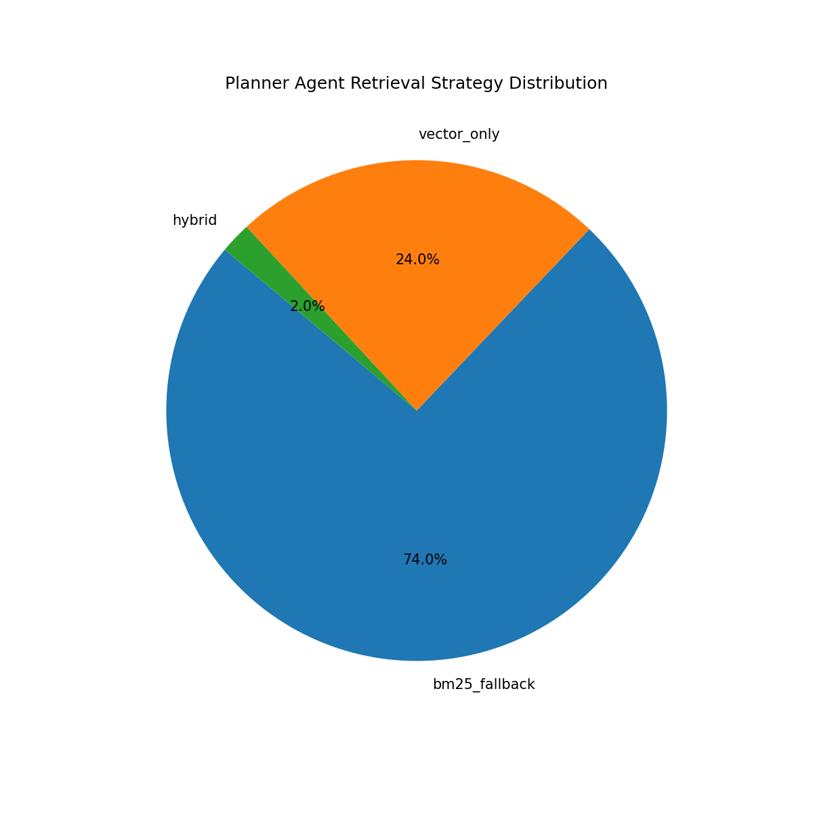

# Results & Discussions: Agentic Workflow Analysis

## Overview

This section analyzes the retrieval strategy distribution selected by the Planner Agent during the Agentic RAG evaluation experiment. The findings are highly relevant for the **System Evaluation** and **Retrieval Strategy Evaluation** sections of the research paper.

*Figure X illustrates the retrieval strategy distribution selected by the Planner Agent across 50 evaluation samples. The majority of sparse vendor profiles (74%) were routed to the BM25 fallback pipeline, while semantically rich profiles (24%) utilized vector-only retrieval. Only 2% of cases required hybrid retrieval, indicating that deterministic completeness thresholds successfully minimized unnecessary LLM planning overhead.*

## What the Figure Represents

This pie chart visualizes how the **LangGraph Planner Agent** dynamically routed queries based on vendor profile completeness:

| Strategy | Meaning | Percentage |
| :--- | :--- | :--- |
| `bm25_fallback` | Used for sparse/incomplete vendor profiles where semantic embeddings may be weak | 74% |
| `vector_only` | Used for highly complete vendor profiles with strong semantic representations | 24% |
| `hybrid` | Used for ambiguous/intermediate completeness cases requiring mixed retrieval | 2% |

---

## Value and Key Insights

This figure demonstrates several critical architectural successes that strengthen the system's contribution to agentic engineering:

### 1. Adaptive Retrieval Intelligence

The TenderMatch system does not rely on a static, one-size-fits-all retrieval pipeline. Instead, it dynamically adapts to the quality of the input data:

* **Sparse profiles** → Routed to keyword/BM25 retrieval to maximize literal matching.
* **Rich profiles** → Routed to vector retrieval for deep semantic understanding.
* **Ambiguous profiles** → Routed to hybrid retrieval for a robust combination of both.

This adaptive methodology is a strong **agentic systems contribution**, proving that the system can reason about its own data quality before executing a search.

### 2. Reduced LLM Cost & Increased Efficiency

Because only 2% of the cases required the more expensive hybrid reasoning path, the system achieves:

* **Lower token usage**
* **Lower latency**
* **Reduced API dependency**
* **High deterministic routing efficiency**

This serves as a strong engineering argument for implementing state-based thresholding as a primary gatekeeper in Agentic RAG architectures.

### 3. Real Agentic Decision Making

This metric is particularly important academically because many modern "AI agents" are simply basic wrappers around sequential LLM calls. In contrast, the TenderMatch Planner Agent actually performs:

* **State inspection** (Evaluating active context)
* **Database lookups** (Querying PostgreSQL for profile completeness)
* **Routing decisions** (Applying conditional logic)
* **Conditional workflow execution** (Dynamically constructing the LangGraph path)

This demonstrates true, stateful agentic orchestration rather than a simple prompt chain.
